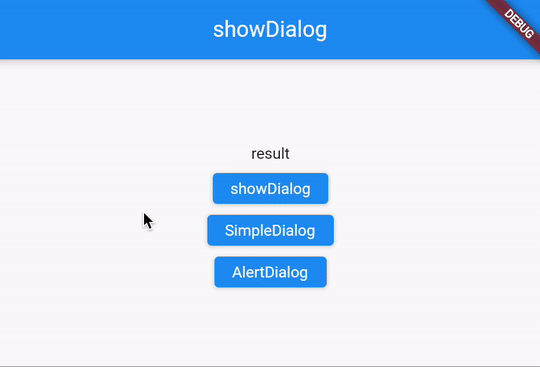

# README

Flutterのモーダルダイアログ表示のサンプルコードです。

## 関連記事
[【Flutter】モーダルダイアログ表示](https://cbtdev.net/flutter-modaldialog-basic/)

## サンプルコードの内容

showDialogで、閉じるボタン、SimpleDialog、AlertDialog、の３種類のダイアログを表示し、戻り値をテキストで表示します。

